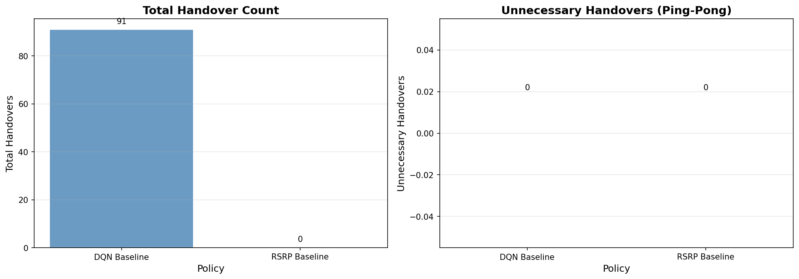
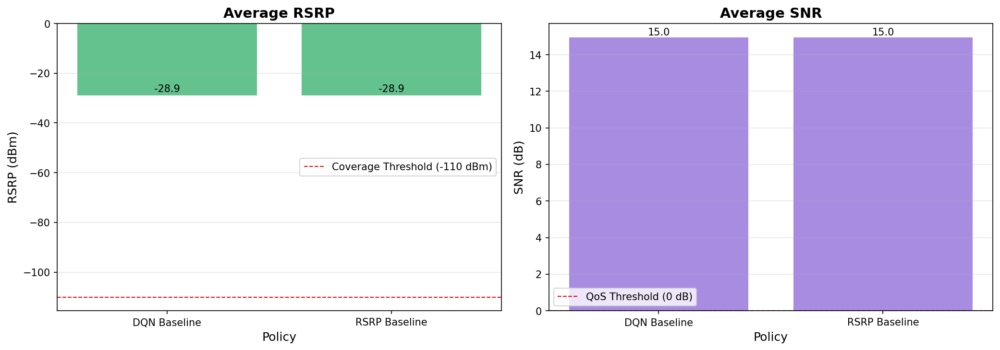
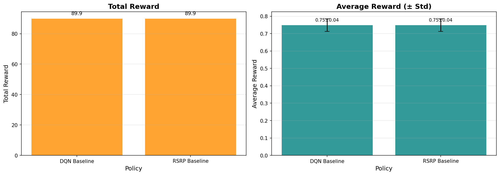

# DQN Baseline Evaluation Report

**生成時間**: 2025-10-23 13:47:59
**測試回合**: 20 episodes per policy
**策略數量**: 2

---

## 📊 性能比較表格

| Policy        |   Total Handovers |   Handover Rate (per min) |   Unnecessary HO | Unnecessary HO Rate   |   Avg RSRP (dBm) |   Avg SNR (dB) | Coverage Rate   | QoS Satisfaction   |   Total Reward |   Avg Reward |   Reward Std |
|:--------------|------------------:|--------------------------:|-----------------:|:----------------------|-----------------:|---------------:|:----------------|:-------------------|---------------:|-------------:|-------------:|
| DQN Baseline  |                91 |                      1820 |                0 | 0.00%                 |           -28.92 |          14.96 | 100.00%         | 100.00%            |          89.93 |        0.749 |        0.037 |
| RSRP Baseline |                 0 |                         0 |                0 | 0.00%                 |           -28.92 |          14.96 | 100.00%         | 100.00%            |          89.93 |        0.749 |        0.037 |

---

## 🎯 關鍵發現

1. **換手優化**: DQN Baseline 增加 0.0% 換手次數
2. **不必要換手**: DQN Baseline 增加 0.0% 乒乓效應
3. **信號品質權衡**: DQN Baseline 平均 RSRP 優 0.00 dB
4. **總體性能**: DQN Baseline 總獎勵低於 0.0%

---

## 📈 視覺化圖表

### 換手指標比較

### QoS 指標比較

### 獎勵指標比較

---

## 📝 詳細指標

### DQN Baseline

**換手指標**:
- 總換手次數: 91
- 換手率: 1820.000 per minute
- 不必要換手: 0 (0.00%)

**QoS 指標**:
- 平均 RSRP: -28.92 dBm
- 平均 SNR: 14.96 dB
- RSRP 範圍: [-34.36, -23.37] dBm
- 覆蓋率: 100.00% (RSRP > -110 dBm)
- QoS 滿足率: 100.00%

**獎勵指標**:
- 總獎勵: 89.93
- 平均獎勵: 0.749 ± 0.037
- 獎勵範圍: [0.67, 0.77]

---

### RSRP Baseline

**換手指標**:
- 總換手次數: 0
- 換手率: 0.000 per minute
- 不必要換手: 0 (0.00%)

**QoS 指標**:
- 平均 RSRP: -28.92 dBm
- 平均 SNR: 14.96 dB
- RSRP 範圍: [-34.36, -23.37] dBm
- 覆蓋率: 100.00% (RSRP > -110 dBm)
- QoS 滿足率: 100.00%

**獎勵指標**:
- 總獎勵: 89.93
- 平均獎勵: 0.749 ± 0.037
- 獎勵範圍: [0.67, 0.77]

---

## 🔬 評估方法

**環境**: Satellite Handover Environment (Gymnasium)
**數據集**: HDF5 test split
**策略評估**: Greedy policy (無探索)
**評估指標**:
- 換手指標（Badini et al. 2024 IEEE TAES）
- QoS 指標（3GPP TS 38.133）
- 獎勵指標（Henderson et al. 2018 AAAI）

---

**報告生成器**: Proposal 003, Phase 4 - Evaluation Framework
**SOURCE**: Academic standards for RL evaluation

---

*此報告由 Orbit Engine DQN Evaluation Framework 自動生成*
