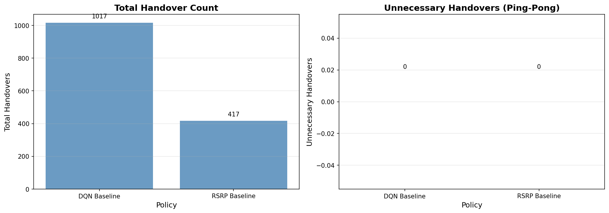
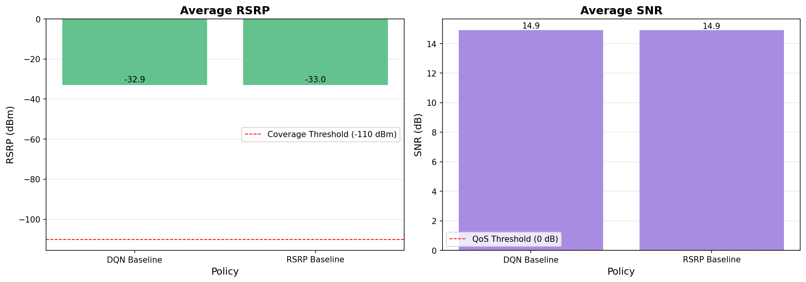
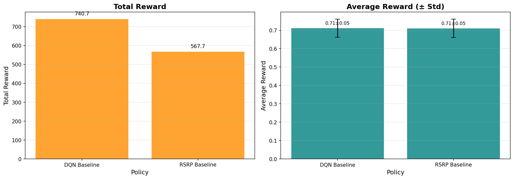

# DQN Baseline Evaluation Report

**生成時間**: 2025-10-23 14:04:11
**測試回合**: 50 episodes per policy
**策略數量**: 2

---

## 📊 性能比較表格

| Policy        |   Total Handovers |   Handover Rate (per min) |   Unnecessary HO | Unnecessary HO Rate   |   Avg RSRP (dBm) |   Avg SNR (dB) | Coverage Rate   | QoS Satisfaction   |   Total Reward |   Avg Reward |   Reward Std |
|:--------------|------------------:|--------------------------:|-----------------:|:----------------------|-----------------:|---------------:|:----------------|:-------------------|---------------:|-------------:|-------------:|
| DQN Baseline  |              1017 |                  3390     |                0 | 0.00%                 |           -32.9  |          14.93 | 100.00%         | 100.00%            |         740.73 |        0.712 |         0.05 |
| RSRP Baseline |               417 |                   641.538 |                0 | 0.00%                 |           -33.05 |          14.91 | 100.00%         | 100.00%            |         567.69 |        0.711 |         0.05 |

---

## 🎯 關鍵發現

1. **換手優化**: DQN Baseline 增加 143.9% 換手次數
2. **不必要換手**: DQN Baseline 增加 0.0% 乒乓效應
3. **信號品質權衡**: DQN Baseline 平均 RSRP 優 0.15 dB
4. **總體性能**: DQN Baseline 總獎勵高出 30.5%

---

## 📈 視覺化圖表

### 換手指標比較

### QoS 指標比較

### 獎勵指標比較

---

## 📝 詳細指標

### DQN Baseline

**換手指標**:
- 總換手次數: 1017
- 換手率: 3390.000 per minute
- 不必要換手: 0 (0.00%)

**QoS 指標**:
- 平均 RSRP: -32.90 dBm
- 平均 SNR: 14.93 dB
- RSRP 範圍: [-44.72, -23.30] dBm
- 覆蓋率: 100.00% (RSRP > -110 dBm)
- QoS 滿足率: 100.00%

**獎勵指標**:
- 總獎勵: 740.73
- 平均獎勵: 0.712 ± 0.050
- 獎勵範圍: [0.66, 0.77]

---

### RSRP Baseline

**換手指標**:
- 總換手次數: 417
- 換手率: 641.538 per minute
- 不必要換手: 0 (0.00%)

**QoS 指標**:
- 平均 RSRP: -33.05 dBm
- 平均 SNR: 14.91 dB
- RSRP 範圍: [-44.66, -23.30] dBm
- 覆蓋率: 100.00% (RSRP > -110 dBm)
- QoS 滿足率: 100.00%

**獎勵指標**:
- 總獎勵: 567.69
- 平均獎勵: 0.711 ± 0.050
- 獎勵範圍: [0.66, 0.77]

---

## 🔬 評估方法

**環境**: Satellite Handover Environment (Gymnasium)
**數據集**: HDF5 test split
**策略評估**: Greedy policy (無探索)
**評估指標**:
- 換手指標（Badini et al. 2024 IEEE TAES）
- QoS 指標（3GPP TS 38.133）
- 獎勵指標（Henderson et al. 2018 AAAI）

---

**報告生成器**: Proposal 003, Phase 4 - Evaluation Framework
**SOURCE**: Academic standards for RL evaluation

---

*此報告由 Orbit Engine DQN Evaluation Framework 自動生成*
