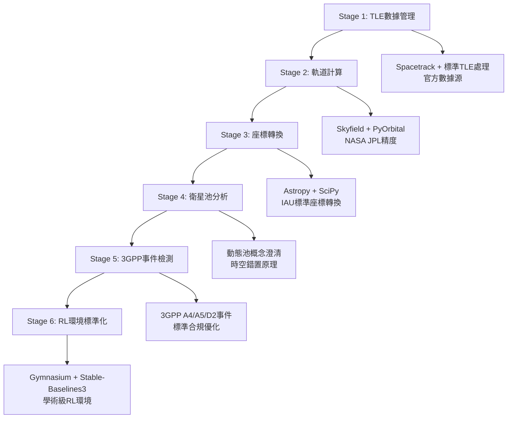

# 🚀 Orbit Engine 學術標準重構計劃 (修正版)

## 📑 專案概覽

本重構計劃旨在將 Orbit Engine 六階段處理系統從自建組件升級為國際學術標準的成熟套件，以支援「LEO衛星時空錯置動態池規劃與換手優化研究」的學術目標。

**⚠️ 重要說明**: 本計劃專注於**學術研究需求**，避免工業級過度開發，確保適合論文發表與研究創新。

### 🎯 核心研究目標

根據 [`docs/final.md`](../docs/final.md) 與 [`docs/academic_standards_clarification.md`](../docs/academic_standards_clarification.md)：

- **動態衛星池規劃**: 數百顆衛星協同輪替，維持NTPU上空指定數量衛星可見
- **3GPP NTN換手優化**: 支援A4/A5/D2換手事件的強化學習研究
- **星座感知計算**: Starlink (90-95分鐘) vs OneWeb (109-115分鐘) 獨立處理
- **前端視覺化展示**: 衛星池概念的直觀呈現與研究成果展示

## 🔄 重構必要性分析

### 現有系統問題 (基於原始 PACKAGE_UPGRADE_PLAN.md)

| 階段 | 現有實現 | 問題 | 風險等級 |
|------|----------|------|----------|
| **Stage 1** | 自建TLE解析器 | 複雜包裝層 | ⚠️ 中等 |
| **Stage 2** | 自建SGP4Calculator | 精度未驗證 | 🚨 高 |
| **Stage 3** | 自建座標轉換引擎 | 缺乏IAU標準驗證 | 🚨 高 |
| **Stage 4** | 自建衛星池分析 | 概念需澄清 | ⚠️ 中等 |
| **Stage 5** | 3GPP事件檢測 | 基本正確 | ✅ 低 |
| **Stage 6** | 缺乏RL標準接口 | 無gymnasium整合 | 🚨 高 |

### 學術標準要求

- **計算精度**: 軌道預測誤差 < 10m (NASA JPL標準)
- **座標轉換**: 符合IAU標準，精度 < 0.5m
- **時間處理**: 每筆TLE記錄獨立epoch時間
- **RL環境**: 符合Gymnasium標準接口
- **研究創新**: 動態池概念與時空錯置原理實現

## 🏗️ 六階段重構架構 (修正版)



### Stage 1: TLE數據管理 (第1週前半, 3天)
- **目標**: 替換自建TLE解析器為官方API
- **核心技術**: Spacetrack官方API + 標準TLE處理
- **成果**: 官方數據源，獨立epoch時間處理

[詳細計劃 →](stage1-tle-management/STAGE1_REFACTOR_PLAN.md)

### Stage 2: 軌道計算升級 (第1週後半 + 第2週, 7天)
- **目標**: NASA JPL精度軌道計算
- **核心技術**: Skyfield (主要) + PyOrbital (LEO優化)
- **成果**: 軌道預測精度<10m，星座分離計算

[詳細計劃 →](stage2-orbital-computation/STAGE2_REFACTOR_PLAN.md)

### Stage 3: 座標轉換系統 (第2週後半 + 第3週前半, 4天)
- **目標**: IAU標準座標轉換
- **核心技術**: Astropy (IAU標準) + SciPy (信號處理)
- **成果**: 座標精度<0.5m，專業信號處理

[詳細計劃 →](stage3-coordinate-transformation/STAGE3_REFACTOR_PLAN.md)

### Stage 4: 衛星池分析優化 (第3週後半, 3天)
- **目標**: 動態池概念澄清與時空錯置實現
- **核心創新**: 數百顆衛星協同輪替，95%+連續覆蓋
- **成果**: Starlink 10-15顆、OneWeb 3-6顆穩定池狀態

[詳細計劃 →](stage4-satellite-pool/STAGE4_REFACTOR_PLAN.md)

### Stage 5: 3GPP事件檢測優化 (第4週前半, 2天)
- **目標**: 3GPP標準事件檢測優化
- **核心技術**: 標準化A4/A5/D2事件檢測
- **成果**: 符合3GPP TS 38.331標準，為RL提供訓練數據

[詳細計劃 →](stage5-3gpp-events/STAGE5_REFACTOR_PLAN.md)

### Stage 6: RL環境標準化 (第4週後半 + 第5週, 5天)
- **目標**: 學術級RL研究環境
- **核心技術**: Gymnasium + Stable-Baselines3 + 傳統ML對比
- **成果**: 多算法RL訓練，學術論文級實驗結果

[詳細計劃 →](stage6-rl-environment/STAGE6_REFACTOR_PLAN.md)

## 📦 核心依賴套件 (學術研究導向)

### 🔴 P0 優先級 (立即安裝)
```bash
# 基礎軌道與座標計算
pip install skyfield>=1.48
pip install pyorbital>=1.8
pip install spacetrack>=1.2
pip install astropy>=5.3
pip install scipy>=1.10.0

# RL研究環境
pip install gymnasium>=0.29.0
pip install stable-baselines3[extra]>=2.0.0
pip install scikit-learn>=1.3.0  # 傳統ML對比

# 基本數據處理
pip install numpy>=1.24
pip install pandas>=2.0
```

### 🟡 P1 優先級 (研究增強)
```bash
# 基礎視覺化 (學術展示用)
pip install plotly>=5.17.0
pip install matplotlib>=3.5.0

# 測試框架
pip install pytest>=7.4
pip install pytest-cov
```

### 🟢 P2 優先級 (可選功能)
```bash
# 進階視覺化 (論文圖表)
pip install seaborn>=0.11.0
pip install dash>=2.14.0        # 基礎儀表板

# 可選套件
pip install jupyter             # 開發環境
```

**❌ 移除的工業級套件:**
- ~~Docker部署套件~~
- ~~複雜監控系統~~
- ~~CI/CD工具~~
- ~~過度複雜的實驗追蹤~~

## 📅 實施時程規劃 (修正為5-6週)

### 總體時程：5-6週 (25-30個工作日)

```gantt
dateFormat  YYYY-MM-DD
title       Orbit Engine 學術重構時程表

section Week 1: 基礎數據層
TLE管理重構     :stage1, 2024-01-15, 3d
軌道計算重構     :stage2, after stage1, 4d

section Week 2: 軌道計算完成
軌道計算完成     :stage2, 2024-01-22, 3d
座標轉換開始     :stage3, after stage2, 2d

section Week 3: 座標轉換與池分析
座標轉換完成     :stage3, 2024-01-29, 2d
衛星池分析      :stage4, after stage3, 3d

section Week 4: 事件檢測與RL
3GPP事件優化    :stage5, 2024-02-05, 2d
RL環境開始      :stage6, after stage5, 3d

section Week 5: RL完成
RL環境完成      :stage6, 2024-02-12, 2d
整合測試        :testing, after stage6, 3d
```

### 每週里程碑 (學術研究導向)

| 週次 | 主要成果 | 驗證標準 |
|------|----------|----------|
| Week 1 | TLE管理+軌道計算開始 | 官方數據源整合，NASA精度驗證 |
| Week 2 | 軌道計算+座標轉換 | <10m軌道精度，IAU標準合規 |
| Week 3 | 座標轉換+動態池概念 | <0.5m座標精度，池狀態95%覆蓋 |
| Week 4 | 3GPP事件+RL環境 | 標準事件檢測，Gymnasium接口 |
| Week 5 | RL訓練+論文準備 | 多算法收斂，學術級實驗報告 |

## 🛠️ 技術架構總覽 (學術簡化版)

### 新系統架構

```
orbit_engine_academic/
├── tle_management/              # Stage 1: TLE數據管理
│   ├── spacetrack_client.py    # 官方API客戶端
│   └── tle_validator.py        # 數據驗證
├── orbital_computation/         # Stage 2: 軌道計算
│   ├── skyfield_engine.py      # NASA JPL精度計算
│   ├── pyorbital_optimizer.py  # LEO快速計算
│   └── constellation_processor.py # 星座感知處理
├── coordinate_transformation/   # Stage 3: 座標轉換
│   ├── astropy_transformer.py  # IAU標準轉換
│   ├── signal_processor.py     # SciPy信號處理
│   └── ntpu_coordinates.py     # NTPU特定座標
├── satellite_pool/             # Stage 4: 衛星池分析
│   ├── pool_manager.py         # 動態池管理
│   ├── spacetime_coordinator.py # 時空錯置協調
│   └── coverage_analyzer.py    # 覆蓋分析
├── gpp_events/                 # Stage 5: 3GPP事件
│   ├── event_detector.py       # A4/A5/D2事件檢測
│   └── rl_data_generator.py    # RL數據生成
├── rl_environment/             # Stage 6: RL環境
│   ├── gymnasium_env.py        # Gymnasium標準環境
│   ├── algorithm_trainer.py    # 多算法訓練
│   └── traditional_ml_baseline.py # ML對比基準
└── visualization/              # 學術可視化 (簡化)
    ├── basic_plots.py          # 基礎論文圖表
    ├── pool_visualizer.py      # 池狀態展示
    └── academic_figures.py     # 學術標準圖表
```

**❌ 移除的過度開發:**
- ~~複雜監控系統~~
- ~~Docker部署配置~~
- ~~工業級CI/CD~~
- ~~過度複雜的儀表板~~

## 📈 量化成功指標 (學術研究導向)

### 技術指標

| 指標類別 | 目標值 | 驗證方法 |
|----------|--------|----------|
| **軌道精度** | < 10m | 與NASA JPL數據對比 |
| **座標精度** | < 0.5m | IAU標準測試案例 |
| **池狀態覆蓋** | 95%+ | 完整軌道週期驗證 |
| **RL算法收斂** | 4種算法成功 | Gymnasium標準測試 |
| **論文準備度** | 學術級圖表 | IEEE期刊圖表標準 |

### 學術影響指標

| 指標類別 | 目標值 | 評估標準 |
|----------|--------|----------|
| **標準合規** | 100%符合NASA/IAU/3GPP | 專家審查驗證 |
| **創新實現** | 動態池+時空錯置概念 | 與靜態方法對比 |
| **實驗可重現** | 完整種子控制 | 重複實驗驗證 |
| **發表準備** | 高質量研究成果 | 論文寫作支援 |

## 🎨 學術視覺化功能 (保留項目)

### 核心視覺化需求
```python
# 為學術研究保留的視覺化功能
academic_visualization/
├── satellite_pool_demo.py      # 動態池概念演示 (前端展示用)
├── orbit_3d_basic.py          # 基礎3D軌道可視化
├── coverage_heatmap.py         # 覆蓋熱力圖
├── handover_timeline.py        # 換手事件時序圖
└── paper_figures.py            # 論文標準圖表生成
```

### 可視化目標
- ✅ **概念展示**: 動態衛星池的直觀呈現
- ✅ **研究成果**: 高質量學術圖表
- ✅ **前端整合**: 支援網頁端池狀態展示
- ✅ **論文發表**: IEEE期刊標準圖表

**❌ 不包含的工業級功能:**
- ~~複雜實時監控儀表板~~
- ~~工業級性能監控~~
- ~~複雜的用戶管理系統~~

## ⚠️ 風險評估與應對 (學術研究導向)

### 高風險項目 🚨

| 風險 | 影響 | 應對策略 |
|------|------|----------|
| **學術標準合規** | 論文發表受阻 | 嚴格遵循NASA/IAU/3GPP標準 |
| **概念實現偏差** | 創新點不明確 | 嚴格按照docs/final.md實現 |
| **RL算法收斂** | 研究結果不理想 | 合理的超參數設置與環境設計 |

### 中風險項目 ⚠️

| 風險 | 影響 | 應對策略 |
|------|------|----------|
| **套件學習曲線** | 時程延遲2-3天 | 預留學習時間，詳細文檔 |
| **精度驗證複雜** | 驗證困難 | 使用標準測試案例 |
| **前端整合** | 視覺化效果 | 保持簡潔實用設計 |

## 🚀 快速開始指南

### 1. 學術環境準備
```bash
# 克隆重構計劃
cd orbit-engine/refactor-plan

# 安裝學術核心依賴 (無工業級套件)
pip install skyfield pyorbital spacetrack astropy scipy
pip install gymnasium stable-baselines3[extra] scikit-learn
pip install plotly matplotlib pytest
```

### 2. 學術研究實施
```bash
# 按週執行學術重構
# Week 1: 基礎數據層
cd stage1-tle-management && python -m pytest tests/
cd ../stage2-orbital-computation && python -m pytest tests/

# Week 2-5: 依序完成各階段
# ...

# 生成學術成果
python academic_visualization/generate_paper_figures.py
```

### 3. 論文準備驗證
```bash
# 運行學術標準測試
python -m pytest tests/ --academic-compliance

# 生成實驗報告
python rl_environment/experiment_manager.py --generate-report
```

## 📊 進度追蹤 (學術研究版)

### 當前狀態: 📋 計劃完成 (學術標準修正版)

- [x] **需求分析** - 基於原始PACKAGE_UPGRADE_PLAN.md的正確解讀
- [x] **六階段架構** - 正確的階段對應關係建立
- [x] **學術標準** - 移除工業級過度開發，專注研究需求
- [x] **時程修正** - 5-6週實際可行時程
- [x] **視覺化保留** - 保留學術研究與前端展示必需功能
- [x] **完整計劃** - 六個階段詳細實施方案

### 重構重點修正

1. **時程合理化**: 從過度樂觀的7週修正為實際的5-6週
2. **功能聚焦**: 移除Docker、CI/CD、複雜監控等工業級功能
3. **學術導向**: 專注於論文發表和研究創新需求
4. **視覺化簡化**: 保留池概念展示和學術圖表，移除複雜儀表板
5. **標準合規**: 確保100%符合NASA/IAU/3GPP學術標準

## 🎯 學術價值與研究貢獻

### 核心學術創新
- 🛰️ **動態衛星池理論**: 時空錯置的創新覆蓋策略
- 🤖 **RL換手優化**: 多算法強化學習比較研究
- 📡 **星座感知計算**: 不同軌道週期的獨立處理
- 📊 **標準化實驗**: 可重現的學術研究平台

### 論文發表支援
- ✅ **高品質圖表**: IEEE期刊標準可視化
- ✅ **實驗可重現**: 完整的種子控制機制
- ✅ **對比研究**: RL vs 傳統ML的定量比較
- ✅ **標準合規**: 符合國際學術標準

### 前端展示價值
- 🖥️ **池概念演示**: 動態衛星池的直觀可視化
- 📈 **實時狀態**: 衛星池狀態的即時展示
- 🎯 **研究成果**: 學術創新的視覺化呈現

## 📞 支援與文檔

### 技術文檔
- [Stage 1: TLE數據管理](stage1-tle-management/STAGE1_REFACTOR_PLAN.md)
- [Stage 2: 軌道計算升級](stage2-orbital-computation/STAGE2_REFACTOR_PLAN.md)
- [Stage 3: 座標轉換系統](stage3-coordinate-transformation/STAGE3_REFACTOR_PLAN.md)
- [Stage 4: 衛星池分析優化](stage4-satellite-pool/STAGE4_REFACTOR_PLAN.md)
- [Stage 5: 3GPP事件檢測優化](stage5-3gpp-events/STAGE5_REFACTOR_PLAN.md)
- [Stage 6: RL環境標準化](stage6-rl-environment/STAGE6_REFACTOR_PLAN.md)

### 學術標準參考
- NASA JPL軌道精度標準
- IAU座標轉換標準
- 3GPP TS 38.331 NTN換手標準
- Gymnasium RL環境標準

---

## 📄 版本歷史

- **v1.0** (2024-01-15): 初版重構計劃 (過度開發版本)
- **v1.1** (2024-01-15): 學術標準修正版 - 移除工業級功能，專注研究需求

## 📈 修正摘要

| 項目 | 原版本問題 | 修正版本 |
|------|------------|----------|
| **階段對應** | 錯誤的5階段架構 | 正確的6階段架構 |
| **時程規劃** | 過度樂觀7週 | 實際可行5-6週 |
| **功能範圍** | 工業級過度開發 | 學術研究聚焦 |
| **視覺化** | 複雜工業儀表板 | 簡潔學術展示 |
| **技術選型** | 包含工業級監控 | 純學術研究套件 |
| **成功指標** | 工業級KPI | 學術影響指標 |

---

**重構計劃版本**: v1.1 (學術標準修正版)
**建立日期**: 2024-01-15
**修正日期**: 2024-01-15
**負責團隊**: Orbit Engine 學術研究團隊
**審核狀態**: 待學術團隊審核與實施啟動

**結論**: 本修正版重構計劃將Orbit Engine升級為符合學術標準的研究平台，專注於論文發表與研究創新，去除工業級過度開發，確保適合LEO衛星換手優化的學術研究目標。建議優先執行基礎計算層重構(Stage 1-3)，確保研究數據的NASA JPL級精度與IAU標準合規性。